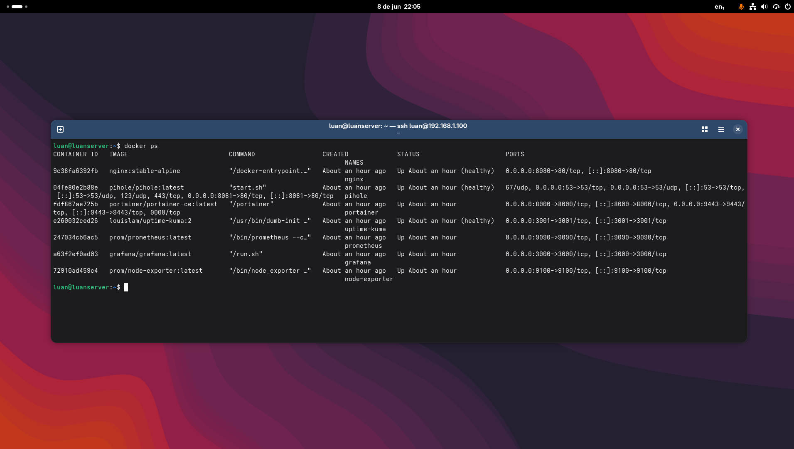

# Homelab

Ambiente de aprendizado e experimentação pessoal rodando em um servidor Ubuntu Server, orquestrado com Docker Compose.

O objetivo principal é praticar conceitos de infraestrutura, observabilidade e redes aplicados no dia a dia de times de Cloud e DevOps.

---

## Hardware e Server

- **ISO:** Ubuntu Server 24.04 LTS
- **Hardware:** Notebook Dell Inspiron 15
    - **Processador:** Intel Pentium Gold 7505 - Dual-Core com clock 2 GHz a 3.5 GHz
    - **Memória RAM:** 4 GB DDR4
    - **Armazenamento:** HD de 512 GB

## Serviços

| Serviço | Descrição | Porta |
|---|---|---|
| **Portainer** | Interface web para gerenciamento de containers Docker | `9443` (HTTPS) |
| **Uptime Kuma** | Monitoramento de disponibilidade dos serviços | `3001` |
| **Grafana** | Dashboards de observabilidade | `3000` |
| **Prometheus** | Coleta e armazenamento de métricas | `9090` |
| **Node Exporter** | Exporta métricas do sistema operacional para o Prometheus | `9100` |
| **Pi-hole** | DNS resolver com bloqueio de anúncios na rede local | `8081` |
| **Nginx** | Servidor web / base para reverse proxy | `8080` |

---

## Pré-requisitos

- Docker >= 24.x
- Docker Compose >= 2.x
- Portas listadas acima disponíveis no host

---

## Como subir o ambiente

**1. Clone o repositório**

```bash
git clone https://github.com/luanvieirateixeira/homelab.git
cd homelab
```

**2. Configure as variáveis de ambiente**

```bash
cp .env.example .env
```

Edite o `.env` com seus valores:

```bash
nano .env
```

**3. Suba os containers**

```bash
docker compose up -d
```

**4. Verifique se tudo subiu**

```bash
docker compose ps
```

---

## Variáveis de ambiente

Copie o `.env.example` e preencha os valores antes de subir o ambiente. **Nunca suba o `.env` real para o repositório.**

| Variável | Descrição |
|---|---|
| `PIHOLE_PASSWORD` | Senha de acesso à interface web do Pi-hole |

---

## Redes

Cada serviço opera em uma rede isolada por padrão. Serviços que precisam se comunicar compartilham a mesma rede interna — por exemplo, `prometheus`, `node-exporter` e `grafana` estão todos na `monitoring_network`.

| Rede | Serviços |
|---|---|
| `monitoring_network` | Prometheus, Node Exporter, Grafana |
| `kuma_network` | Uptime Kuma |
| `nginx_network` | Nginx |
| `pihole_network` | Pi-hole |
| `portainer_network` | Portainer |

---

## Volumes

Todos os dados persistentes são armazenados em volumes Docker nomeados. Os dados sobrevivem a `docker compose down`.

| Volume | Serviço |
|---|---|
| `uptime-kuma` | Uptime Kuma |
| `nginx` | Nginx |
| `portainer_data` | Portainer |
| `prometheus-data` | Prometheus |
| `grafana-data` | Grafana |

---

## Estrutura do repositório

```
homelab/
├── docker-compose.yml
├── .env.example
├── .env                  # não versionado
├── prometheus.yml        # configuração de scrape do Prometheus
└── pihole/
    ├── etc-pihole/
    └── etc-dnsmasq.d/
```

---

## Comandos úteis

```bash
# Subir todos os serviços em background
docker compose up -d

# Parar todos os serviços
docker compose down

# Ver logs de um serviço específico
docker compose logs -f grafana

# Reiniciar um serviço
docker compose restart prometheus

# Ver status e health check
docker compose ps
```

---

## Próximos passos

- [ ] Adicionar PostgreSQL + NocoDB para persistência de dados
- [ ] Configurar Nginx como reverse proxy para os demais serviços
- [ ] Integrar alertas via API com Discord

---

## Autor

**Luan Vieira Teixeira**
[LinkedIn](https://linkedin.com/in/luanvieirateixeira) · [GitHub](https://github.com/luanvieirateixeira)

**Estruturado por mim, corrigido pela IA**

